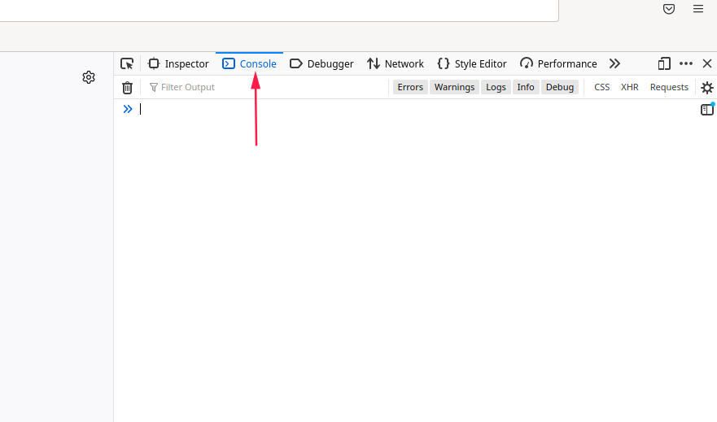

# The Crims Italian Bot
Well well well, if you have come to this web page, by just reading the title, probably you know what is all about :)

In case you don't know, this is a bot that I've developed to play the online game [The Crims](https://www.thecrims.com) without manually performing most of the tedious tasks of the game (robberies, trainings, hunting).

# Bot in action demo

## Single Robbery


## Single Robbery Mobile (thanks Willy)


## Gang Robbery
No video available at the moment.

## Hunting
No video available at the moment, but this is what you see when the bot kill someone:


I'm sorry **eDli** but you have been killed by my bot :)

# Have I been banned for using this Bot?
Unfortunately, YES :(

So be aware that using this bot you may (or may not) get caught by The Crims admins and get banned.

BUT, if you know how can be modified the bot in order to not get caught (or to reduce a lot the risk), PLEASE LET ME KNOW :)

# Rounds Compatibility
I've developed the bot starting from **round 136**.\
I will try to maintain the bot for all other rounds (no promises).

Any help is appreciated :)

# Requirements to run the bot
All you need to run the bot is a **browser**.
Since you also need a browser to play The Crims too, you don't need to install anything :)

I think it will work on **every Operating System** if you use **Firefox** or **Chrome** as browser.

I've tested the bot with the following configurations:
- Windows 10 
    - Chrome
    - Edge
    - Brave Browser
- Fedora Linux 35:
    - Firefox
- Android
  - Kiwi Browser (thanks to Willy for finding this)

and all were working.

## How to use this POWERFUL bot :)

Here below the steps needed to use the bot:

1. Login with your account on The Crims website.
2. Once logged in, open the **Developer Tools** of the browser (in Windows or GNU\Linux the shortcut is F12. If you are having trouble with this step search in Google how to do it). 
3. Once opened the Developer Tools of the browser go to **Console** tab (here below a Firefox example, in Chrome it's very similar)


4. Copy the whole content of `bot.js` and paste it in browser Console.\
WARNING: if the **browser blocks the pasting** see the gif here below, on how to **unblock the browser pasting** (this is necessary only the first time you paste the code of the bot)


5. Once pasted the whole content of `bot.js` **press Enter**, and the bot will start the **UserAction** defined in the bottom part of `bot.js`.\
See **Usage Example** to understand better how to configure the bot to perform a specific **UserAction**.

# Usage Example
At the bottom of `bot.js` file you will find these parts of code:
```Javascript
// Single Robbery
// const user = new User({
//     useFirstRaveOfFavorites: false,
//     userActionToDo: UserActions.SINGLE_ROBBERY, 
// });


// Single Robbery Specific Rob
// const user = new User({
//     useFirstRaveOfFavorites: false,
//     userActionToDo: UserActions.SINGLE_ROBBERY_SPECIFIC_ROB, 
//     specificRob: SingleRobberies.CHUCK_NORRIS
// });


// Gang Robbery
// const user = new User({
//     useFirstRaveOfFavorites: false,
//     userActionToDo: UserActions.GANG_ROBBERY, 
//     specificRob: GangRobberies.BANK
// });

// Trainings
// const user = new User({
//     useFirstRaveOfFavorites: false,
//     userActionToDo: UserActions.TRAINING, 
//     trainingsToDoList: [Trainings.MARTIAL_ARTS_30min, Trainings.EDUCATION_30min]
// });

// Hunting
// const user = new User({
//     useFirstRaveOfFavorites: false,
//     victimRespect: {min: 500, max: 50000},
//     userActionToDo: UserActions.HUNTING, 
// });
```
These are all **predefined templates** of **Actions** that you can do with the bot.

All **Actions** include **recharge stamina** and **detox** functionalities and will be executed automatically.

The **rave** used to **recharge stamina** must be one with beer inside.

You can change the value of property `useFirstRaveOfFavorites` with the following values:
- set it to `true` to use the first rave in favorites list (be sure there's one)
- set it to `false` to use a random one picked from 
nightlife.

The detox is performed when addiction value is around 5.

To **STOP** the bot, just **refresh** the page.

## Single Robbery Action
```Javascript
// Single Robbery
const user = new User({
    useFirstRaveOfFavorites: false,
    userActionToDo: UserActions.SINGLE_ROBBERY, 
});

// ALL OTHER TEMPLATES MUST BE DELETED OR PREFIXED WITH //
```
With this bot configuration will be performed the most difficult **Single Robbery** the user can do based on **Single Robbery Power**.\
As the user go up with Single Robbery Power, the bot will automatically calculates the new Single Robbery to do.

(WARNING: here are excluded robberies with drugs/components rewards,because they give low money)

## Single Robbery Specific Rob Action
```Javascript
// Single Robbery Specific Rob
const user = new User({
    useFirstRaveOfFavorites: false,
    userActionToDo: UserActions.SINGLE_ROBBERY_SPECIFIC_ROB, 
    specificRob: SingleRobberies.CHUCK_NORRIS
});

// ALL OTHER TEMPLATES MUST BE DELETED OR PREFIXED WITH //
```
With this bot configuration will be performed the **Specific Single Robbery** defined in property `specificRob`.\
In the above code example, will always be performed **Chuck Norris** robbery.\
The complete list of Specific Single Robberies is the following (some are missing, if you know the the id let me know and I will add them):
```Javascript
SingleRobberies.SHOPLIFT         
SingleRobberies.OLD_LADY         
SingleRobberies.CAR_BREAK_IN     
SingleRobberies.TAXI             
SingleRobberies.HOUSE            
SingleRobberies.GAS_STATION      
SingleRobberies.GROCERY_STORE    
SingleRobberies.KIDNAPPING       
SingleRobberies.JEWELLERY        
SingleRobberies.LITTLE_CITY_BANK 
SingleRobberies.MAFFIA_BOSS      
SingleRobberies.CAR_SALOON       
SingleRobberies.LOCAL_BASTARDS   
SingleRobberies.LOCAL_DEALER     
SingleRobberies.CASINO           
SingleRobberies.RAVE_PARTY       
SingleRobberies.NATIONAL_MUSEUM  
SingleRobberies.GRANDE_MAFIOSO   
SingleRobberies.CARNIVAL         
SingleRobberies.DRUG_KING        
SingleRobberies.SAFETY_DEPOSIT   
SingleRobberies.RUSSIAN_DRUG_KING
SingleRobberies.COMPUTER_STORE   
SingleRobberies.MOTORCYCLE_GANG  
SingleRobberies.CHUCK_NORRIS     
SingleRobberies.THE_VATICAN      
SingleRobberies.SEA_CAPTAIN      
SingleRobberies.MILLIONAIRE_YACHT
SingleRobberies.MOROCCAN_HARBOUR 
SingleRobberies.PHARMACY         
SingleRobberies.AMBULANCE        
SingleRobberies.DRUG_FACTORY     
SingleRobberies.HARDWARE_STORE   
SingleRobberies.HOSPITAL         
SingleRobberies.LOCAL_PUSHER     
SingleRobberies.TALIBAN_SQUAD    
SingleRobberies.LATIN_KINGS      
SingleRobberies.JAMAICAN_CREW    
SingleRobberies.THE_REDNECKS_CREW
SingleRobberies.VOODOO_PRIEST    
```

## Gang Robbery Action
```Javascript
// Gang Robbery
const user = new User({
    useFirstRaveOfFavorites: false,
    userActionToDo: UserActions.GANG_ROBBERY, 
    specificRob: GangRobberies.BANK
});

// ALL OTHER TEMPLATES MUST BE DELETED OR PREFIXED WITH //
```
With this bot configuration will be automatically pressed **Accept** and **Do the score!** button in **Gang Robbery**.\
Obviously, you need to be part of a gang to make this work.\
The complete list of Gang Robbery is the following (some are missing, if you know the the id let me know and I will add them):
```Javascript
GangRobberies.FOREX                  
GangRobberies.BANK                   
GangRobberies.VALUE_TRANSPORT        
GangRobberies.FEDERAL_RESERVE        
GangRobberies.STEVEN_SEAGULL         
GangRobberies.AL_CAPONE              
GangRobberies.BUCKINGHAM_PALACE      
GangRobberies.DRUG_FACTORY           
GangRobberies.CASINO_ROYALE          
GangRobberies.MANIPULATE_STOCK_MARKET
GangRobberies.GILL_BATES             
GangRobberies.FORT_KNOX              
GangRobberies.BITCOIN_BANK           
GangRobberies.ILLUMINATI             
GangRobberies.OIL_TYCOON_DUBAI       
GangRobberies.BILL_GATES             
```

## Training Action
```Javascript
// Training
const user = new User({
    useFirstRaveOfFavorites: false,
    userActionToDo: UserActions.TRAINING, 
    trainingsToDoList: [Trainings.MARTIAL_ARTS_30min, Trainings.EDUCATION_30min]
});

// ALL OTHER TEMPLATES MUST BE DELETED OR PREFIXED WITH //
```
With this bot configuration will be automatically executed the **Trainings** specified in `trainingsToDoList`.\
In the above example, will be executed:
- A 30 minutes Martial Arts training
- A 30 minutes Education training

The trainings will be executed once at a time and the bot will wait the correct amount of time before do the next training.

The complete list of Training is the following:
```Javascript
Trainings.GYM_30min         
Trainings.GYM_1h            
Trainings.EDUCATION_30min   
Trainings.EDUCATION_1h      
Trainings.CASANOVA_30min    
Trainings.CASANOVA_1h       
Trainings.MARTIAL_ARTS_30min
Trainings.MARTIAL_ARTS_1h   
```


## Hunting Action
```Javascript
// Hunting
const user = new User({
    useFirstRaveOfFavorites: false,
    huntingOptions: {
        victimRespect: {min: 500, max: 4000, hitmanMaxRespect: 3000}, 
        delayBeforeAttackUser: 0.5,
        useOnlyHookersHouse: false
    },
    userActionToDo: UserActions.HUNTING, 
});

// ALL OTHER TEMPLATES MUST BE DELETED OR PREFIXED WITH //
```
With this bot configuration the bot will automatically start **Hunting** in random raves users to assault.\
Before kill someone, the following checks are performed:
- checks if as soon as entered the rave there's only one visitor: if there are more than 1 visitors, it will exit immediately (this is to avoid to be killed by another visitors in case of multiple visitors in the rave).
- checks if victim respect is between min and max defined in property `victimRespect`. In case victim is a HITMAN, the max limit in this case is defined by the property `hitmanMaxRespect`.

If the above conditions are matched, then it will kill the victim.

Once killed someone, it immediately presses Exit button, to exit from rave.


